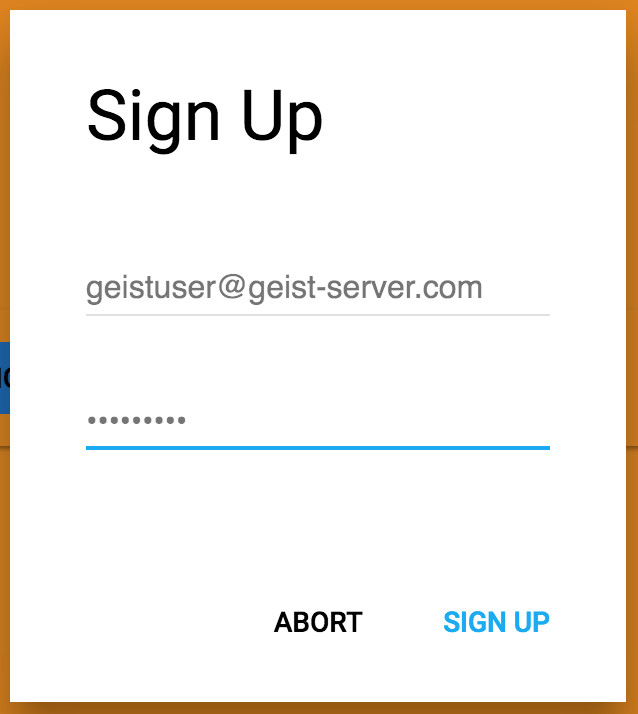

# Geist

## Details
`Geist` is an easy to use upload tool.
It use [Firebase Storage](https://firebase.google.com/docs/storage/) to store files in the cloud.

## Features
See this article on [Medium](https://medium.com/@StefMa/geist-uploading-made-easy-6d8769469fa4).

## Setup
Before you start you need to follow these steps to setup `Geist` correctly.

1. Create a `Geist Server` instance (See [`Geist Server Setup`](https://github.com/stefma/Geist-Server)).
2. Replace the `$YOUR_🔥BASE_PROJECTID` with your Firebase Project Id in [`main.js`](main.js)
3. [Build `Geist`](#how-to-build).
4. Create a User. Run `Geist`, open the Tray -> Settings and click sign up.


## How to build

#### What is needed
* [Homebrew](http://brew.sh/) to install "build tools"
* [yarn](https://yarnpkg.com) to build and distribute
> Can be installed via `brew install yarn`
* [ffmpeg](https://ffmpeg.org/) to convert videos to gifs
> Can be installed via `brew install ffmpeg`

#### Build
1. Check [What is needed](#what-is-needed)
2. Clone the repo
3. `yarn install`
4. `node_modules/.bin/electron .`
5. Smile! \o/

#### Build a release
To build a release just run
```
yarn run distribute
```
This will build a `.app`, `.zip` & `.dmg` file into the `dist/mac` directory.
Actually it builds for `mac x64`.

This will also remove the App from the recent window (tab switcher).

> **Note:** You can also build a single `.app` file with `yarn run pack`

## Credits
* [`aperture`](https://github.com/wulkano/aperture) - For this awesome screen recoding tool
* [`Kap`](https://github.com/wulkano/kap) - For making Kap open source! I've looked for some stuff how they implemented it. That have helped me a lot with this project! Thank you ❤️.
* [`milan.kohu`](https://www.iconfinder.com/milan.kohut) - For this awesome [icon](https://www.iconfinder.com/icons/367620/adobe_cloud_creative_cloud_creative-cloud_icon).
